## Table of Contents
Following are all the graphs for Object Detection Datasets.

* ILSVRC\_2014-mAP\_test

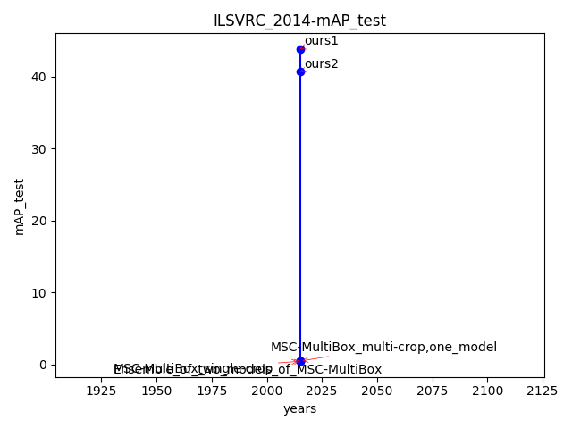

* ILSVRC\_2014-mAP\_val1

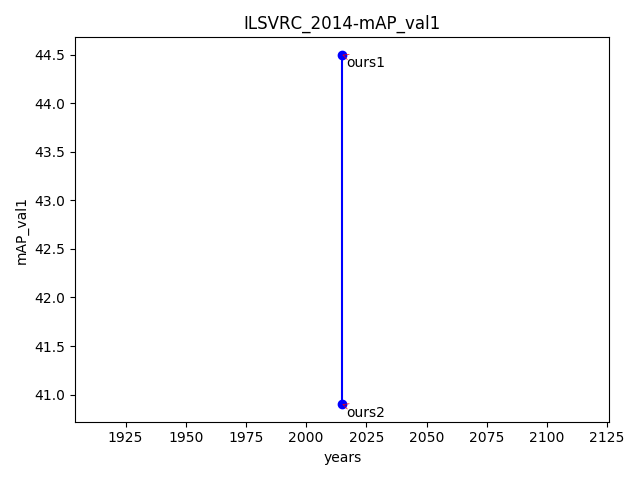

* Inner\_city-mAP

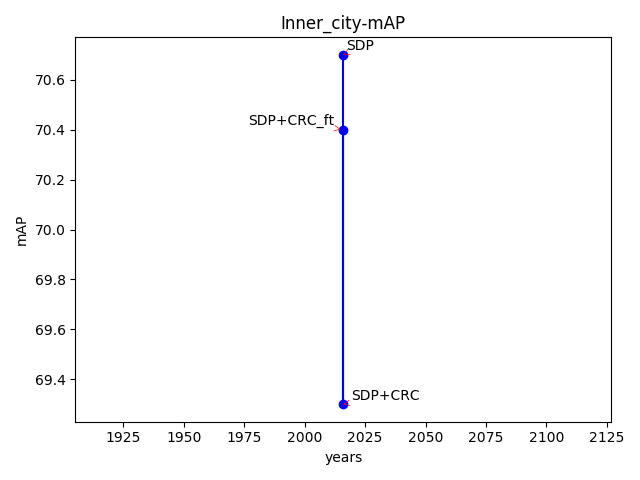

* KITTI-CATEGORY\_CAR\_AP

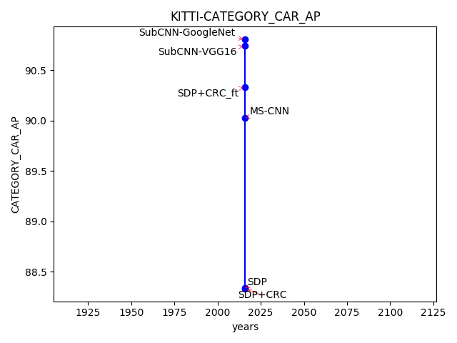

* KITTI-CATEGORY\_CYCLIST\_AP

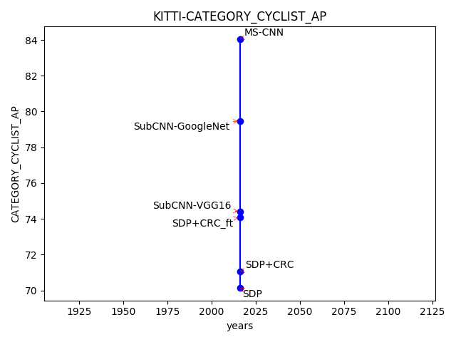

* KITTI-CATEGORY\_PEDESTRIAN\_AP

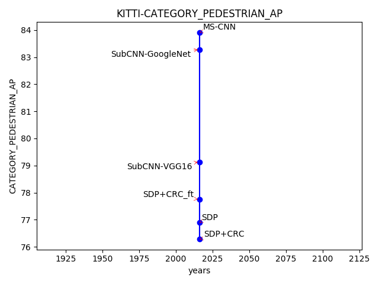

* KITTI-mAP

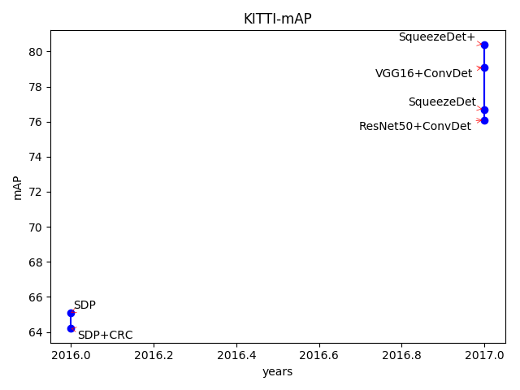

* MS\_COCO\_2015-AP

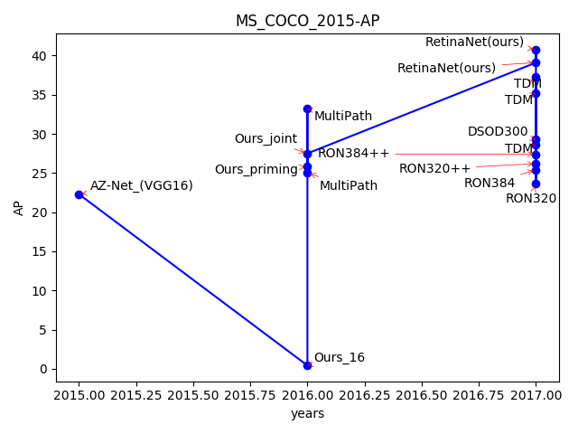

* MS\_COCO\_2015-AP@.50IOU

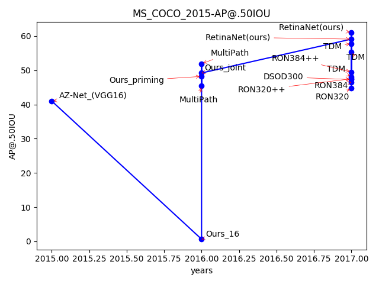

* MS\_COCO\_2015-AP@.75IOU

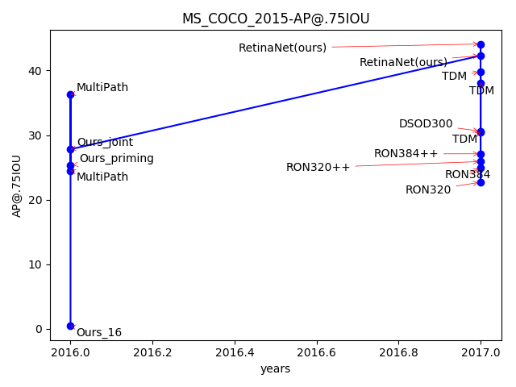

* MS\_COCO\_2015-AP\_large

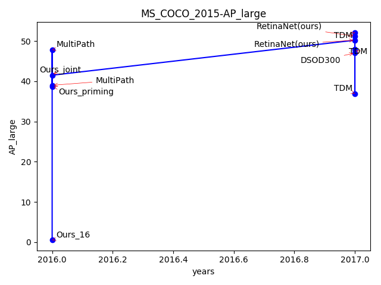

* MS\_COCO\_2015-AP\_med

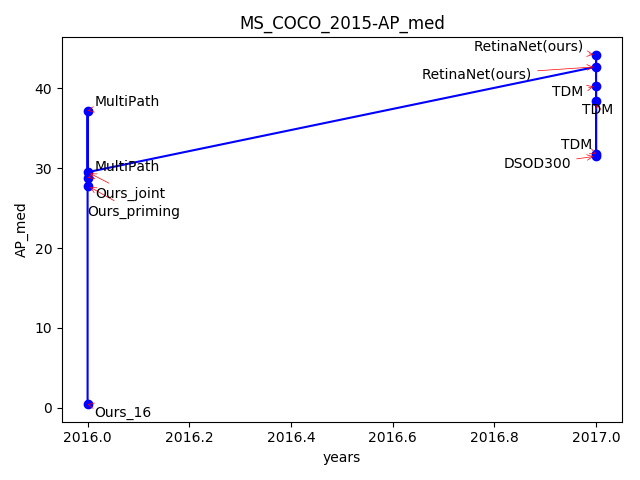

* MS\_COCO\_2015-AP\_small

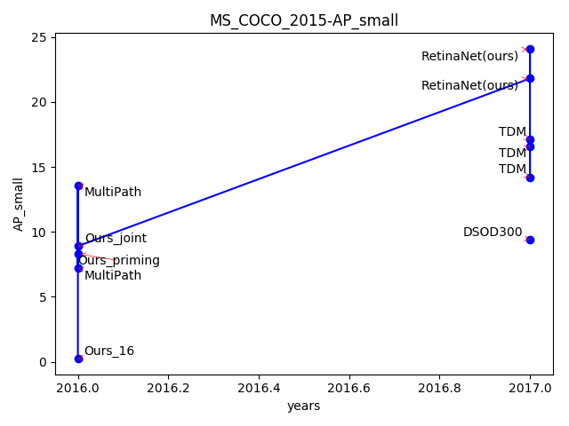

* MS\_COCO\_2015-AR@1

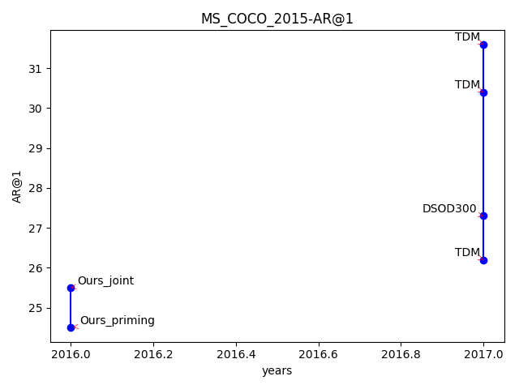

* MS\_COCO\_2015-AR@10

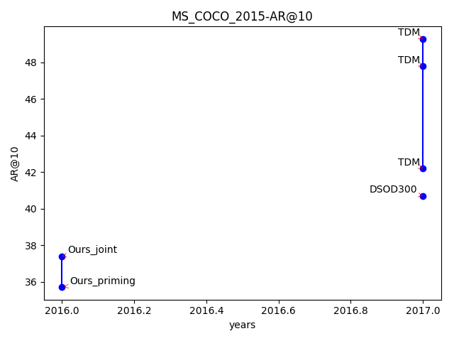

* MS\_COCO\_2015-AR@100

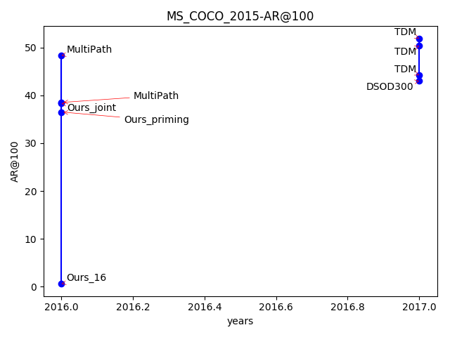

* MS\_COCO\_2015-AR\_large

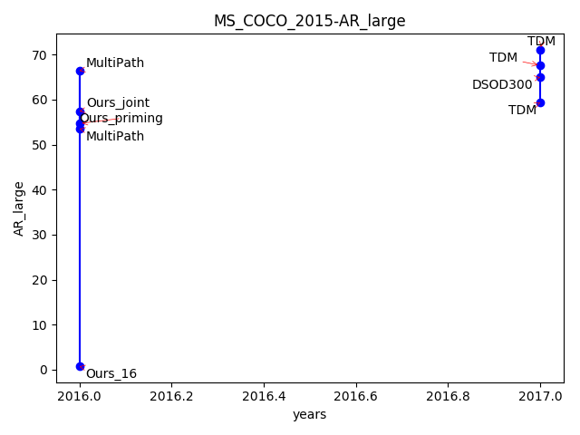

* MS\_COCO\_2015-AR\_med

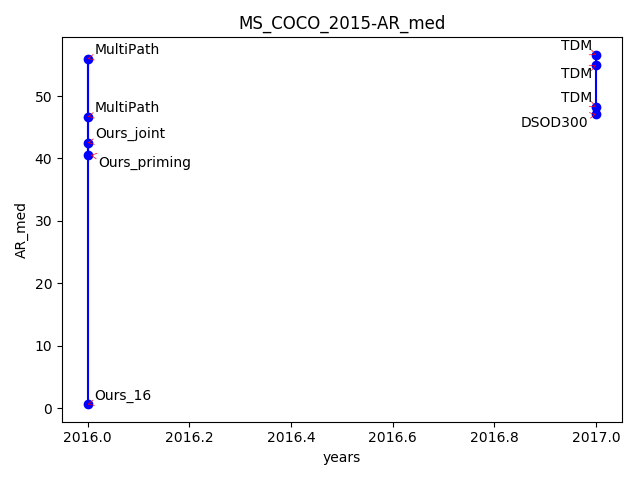

* MS\_COCO\_2015-AR\_small

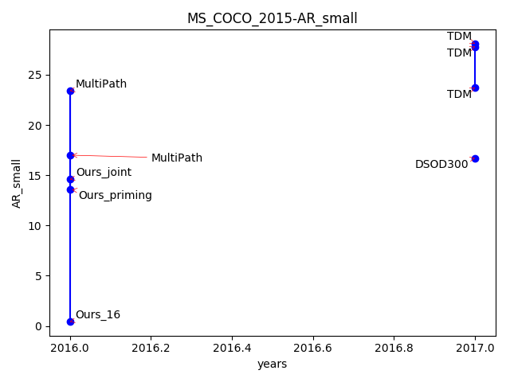

